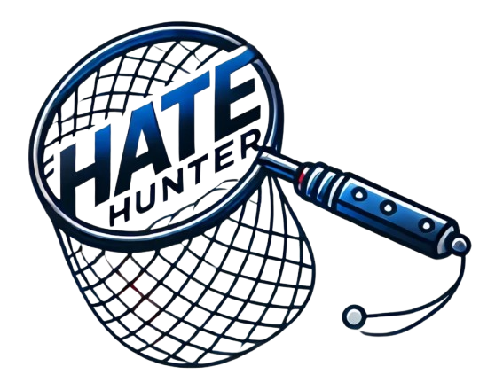
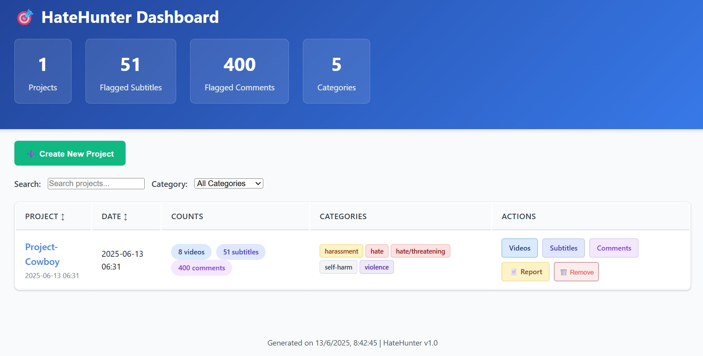

<p align="center">
  
</p>

# HateHunter 🎯

**Advanced AI-powered tool for detecting hate speech and harmful content in YouTube videos and comments**

HateHunter is a comprehensive analysis platform that uses OpenAI's GPT models to identify, categorize, and report hate speech, discriminatory language, and harmful content across YouTube channels and individual videos. The tool analyzes both video subtitles and comment sections, providing detailed reports with highlighted problematic content.

<p align="center">
  
</p>

## ✨ Features

### 🔍 **Multi-Source Analysis**
- **Video Subtitles**: Analyzes transcripts and auto-generated captions
- **Comments Section**: Scans through video comments and replies
- **Channel-wide Analysis**: Process entire YouTube channels automatically
- **Individual Video Processing**: Target specific videos for detailed analysis

### 🤖 **AI-Powered Detection**
- **OpenAI GPT Integration**: Leverages advanced language models for accurate detection
- **Keyword Filtering**: Focus analysis on specific terms or topics

### 📊 **Comprehensive Reporting**
- **Interactive Web Dashboard**: Modern, responsive interface
- **Detailed HTML Reports**: Exportable reports with highlighted content
- **Timestamp Links**: Direct links to problematic content
' **Real-time Team Collaboration**: Live updates when multiple users work on the platform

## 🚀 Quick Start

### Prerequisites

- Python 3.8+
- OpenAI API key
- Yt-dlp (for Youtube API interactions)

### Installation

1. **Clone the repository**
   ```bash
   git clone https://github.com/lobuhi/hatehunter.git
   cd hatehunter
   ```

2. **Install dependencies**
   ```bash
   pip install -r requirements.txt
   ```

3. **Start the application**
   ```bash
   python server.py
   ```

4. **Open your browser**
   Navigate to `http://localhost:1337`

### Basic Usage

1. **Create a New Project**
   - Click "New Project" and enter a project name
   - Projects help organize your analyses

2. **Add New Video To Analyse**
   - **Single Videos**: Add individual YouTube URLs
   - **Channel Mode**: Analyze entire YouTube channels
   - Enter your OpenAI API key in the analysis form

3. **Configure Settings**
   - Choose rate limiting to respect API quotas
   - Enable/disable subtitle and comment analysis
   - Add optional keyword filters

4. **Start Analysis**
   - Click "Add to Queue" to begin processing
   - Monitor progress in real-time
   - View results as they become available

## 📋 Command Line Usage

HateHunter also supports direct command-line execution:

```bash
# Analyze a single video
python hatehunter.py --project "my_project" --video "https://youtube.com/watch?v=VIDEO_ID" --openai-api-key "your_key"

# Analyze a channel
python hatehunter.py --project "my_project" --channel "https://youtube.com/@channel" --openai-api-key "your_key"

# With custom settings
python hatehunter.py \
  --project "my_project" \
  --video "https://youtube.com/watch?v=VIDEO_ID" \
  --openai-api-key "your_key" \
  --threshold 30 \
  --rate-limit 2 \
  --keywords "specific,terms,to,focus" \
  --comments \
  --language en
```

### Command Line Options

| Option | Description | Default |
|--------|-------------|---------|
| `--project` | Project name for organization | Required |
| `--video` | Single YouTube video URL | - |
| `--channel` | YouTube channel URL | - |
| `--openai-api-key` | OpenAI API key | Required |
| `--threshold` | Chunk of seconds to analyse | 30 |
| `--rate-limit` | Delay between API calls (seconds) | 1 |
| `--keywords` | Comma-separated keywords to focus on | - |
| `--comments` | Enable comment analysis | False |
| `--language` | Content language | en |
| `--update-ytdlp` | Update yt-dlp before processing | False |
| `--skip-convert` | Skip video conversion step | False |
| `--skip-analyze` | Skip AI analysis (extract only) | False |

## 🏗️ Architecture

### Web Application
- **Flask Backend**: RESTful API for processing and data management
- **Frontend**: HTML5, CSS3, and vanilla JavaScript
- **Real-time Updates**: Live progress tracking and notifications through websockets

### Core Components
- **Video Data Processor**: Handles YouTube Auto-Generated Subtitles and Comments
- **AI Analyzer**: Integrates with OpenAI's `omni-moderation-latest` model for content analysis
- **Report Generator**: Creates detailed HTML reports
- **Project Manager**: Organizes analyses and data storage

### Data Storage
- **SQLite Database**: Stores analysis results and metadata

### Compliance
- **YouTube Terms**: Respects YouTube's API usage policies
- **Rate Limiting**: Implements respectful request patterns
- **Fair Use**: Analyzes content for safety research purposes

### Disclaimer
HateHunter is a detection tool, not an automated content removal system. All flagged content should be reviewed by human moderators before taking action. The tool aims to assist human judgment, not replace it.

## 🙏 Acknowledgments

- **OpenAI**: For providing the powerful language models
- **yt-dlp**: For reliable YouTube video downloading

## Contributing

Contributions, issues, and feature requests are welcome! Feel free to open an issue or submit a pull request. Or **[buy me a coffee.](https://buymeacoffee.com/lobuhi)**

*Made with ❤️ for a safer internet*